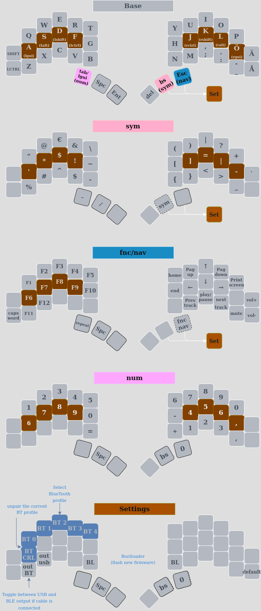

# Introduction

This is for the zmk layout for the brain and sweep/urchin keyboards.
It contains swedish characters and swedish symbol codes

Modified from iamDrakkir's original config into QWERTY with some additional modifications, such as easier placement of different brackets.

## Brain layout

## Symbol mnemonic/reminders
| Symbol | Name                         |  Letter   | Mnemonic           |
| :----: | ---------------------------- | :-------: | ------------------ |
|  `!`   | Exclamation mark             |    `F`    | **F**UCK!!         |
|  `#`   | Hash                         |    `X`    | **X**≈#            |
|  `$`   | Dollar                       |    `D`    | **D**ollar         |
|  `%`   | Percent                      |    `Z`    | **Z**≈%            |
|  `^`   | Caret                        |    `C`    | **C**aret          |
|  `&`   | And                          |    `R`    | **R**≈&            |
|  `*`   | Asterisk, star               |    `S`    | **S**tar           |
|  `_`   | Underscore                   |    `U`    | None               |
|  `-`   | Hyphen, minus, or dash       |    `M`    | None               |
|  `+`   | Plus                         |    `P`    | **P**lus           |
|  `=`   | Equal                        |    `E`    | **E**qual          |
|  `\`   | Backslash                    |    `B`    | Non                |
|  `\|`  | Vertical bar, pipe, or or    |    `I`    | **I**≈\|           |
|  `'`   | Apostrophe, Single quote     |    `A`    | **A**postrophe     |
|  `"`   | Quotation mark, Double quote |    `Q`    | **Q**uotation mark |
|  `?`   | Question mark                |    `?`    | None               |
|  `~`   | Tilde                        |    `N`    | None               |
|  `@`   | At                           |    `W`    | None               |
|  `(`   | Open or Left parenthesis     |    `J`    | None               |
|  `)`   | Close or Right parenthesis   |    `L`    | None               |
|  `{`   | Open or Left brace           |    `K`    | None               |
|  `}`   | Close or Right brace         |    `H`    | None               |
|  `[`   | Open or Left bracket         |    `G`    | None               |
|  `]`   | Close or Right bracket       |    `V`    | None               |
|  `<`   | Less than                    |    `,`    | None               |
|  `>`   | Greater than                 |    `:`    | None               |
|  `;`   | Semicolon                    | baselayer | None               |
|  `:`   | Colon                        | baselayer | None               |
|  `,`   | Comma                        | baselayer | None               |
|  `.`   | Period, dot, or full stop    | baselayer | None               |
|  `/`   | Slash or forward slash       | baselayer | None               |

# TODO:

- Update Mnemonics
- Remove duplicate symbols
